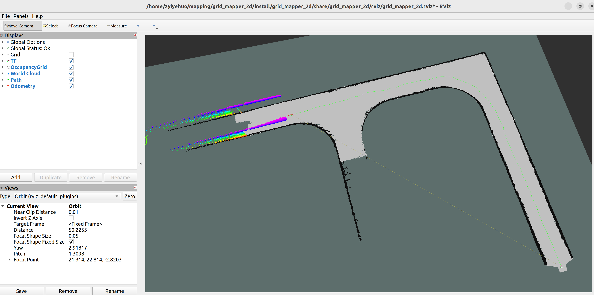
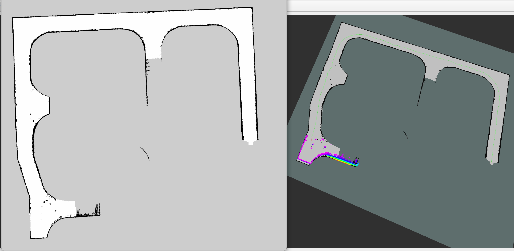
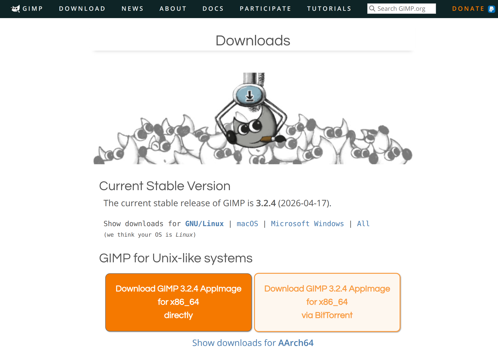
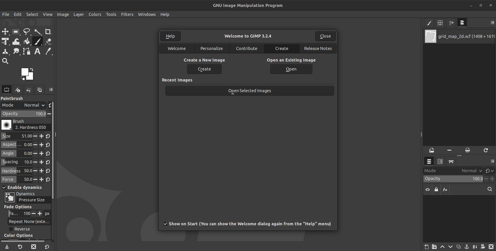
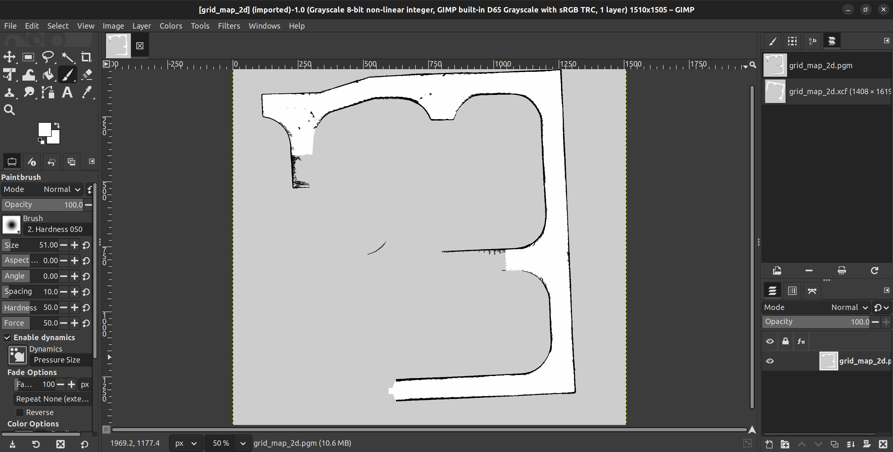
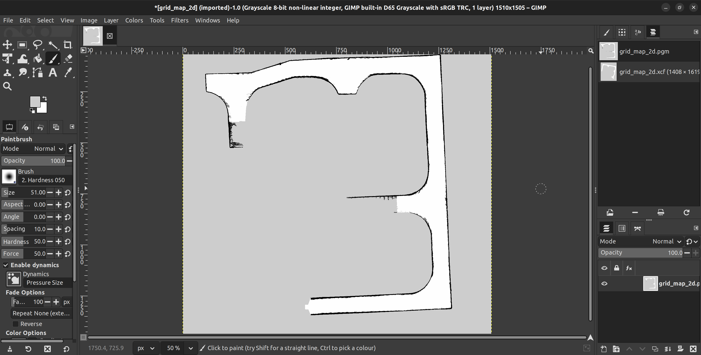
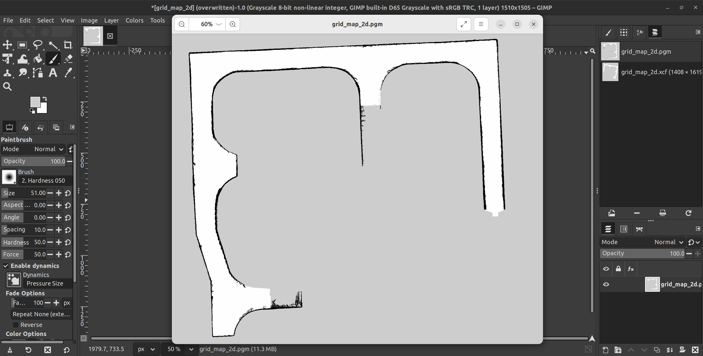

# 2D 栅格地图构建

## 效果图



## 基本配置

> 运行环境：ROS2 humble

> 需要话题：雷达话题、IMU话题

```yaml
grid_mapper_2d:
  ros__parameters:
    cloud_topic: "/rslidar_points"
    imu_topic: "/xsens_chetou/imu/data"
    map_frame: "map"
    body_frame: "base_link"
    save_dir: "/home/zylyehuo/mapping/grid_mapper_2d/src/grid_mapper_2d/map"

    resolution: 0.05
    global_map_init_size_m: 20.0
    global_map_expand_padding_m: 10.0

    range_max: 50.0
    raycast_max_range: 10.0
    publish_period_ms: 500
    scan_duration: 0.1

    carto_2d_optimization: true

    # 每帧只用雷达当前扫描的前方点更新全局地图。
    map_front_only_en: true
    map_front_min_x: 0.0
    map_lateral_limit_y: 0.0

    # 高度过滤
    obstacle_z_min: 0.0
    obstacle_z_max: 0.5

    use_elevation_ground_filter: true
    sensor_mount_height: 4.0
    elevation_grid_res: 0.5
    elevation_z_tolerance: 0.30
    elevation_max_slope: 0.15

    voxel_leaf_scan: 0.30
    voxel_leaf_map: 0.40
    voxel_leaf_grid: 0.05

    exclude_box_en: true
    exclude_box_min_x: -1.2
    exclude_box_max_x: 1.2
    exclude_box_min_y: -1.0
    exclude_box_max_y: 1.0
    exclude_box_min_z: -3.0
    exclude_box_max_z: 0.8

    self_filter_en: true
    self_filter_min_x: -0.2
    self_filter_max_x: 0.2
    self_filter_min_y: -0.2
    self_filter_max_y: 0.2
    self_filter_min_z: -6.5
    self_filter_max_z: 1.2
    self_filter_clear_margin: 0.35
    self_filter_clear_log_odds: -2.0

    # 用于去除铲车后半身、铰接转弯时扫到的自身结构。
    dynamic_self_mask_en: true
    dynamic_self_mask_res: 0.12
    dynamic_self_mask_max_range: 12.0
    dynamic_self_mask_half_width: 5.0
    dynamic_self_mask_front_x: 0.8
    dynamic_self_mask_z_min: -6.5
    dynamic_self_mask_z_max: 1.5
    dynamic_self_mask_seed_min_x: -2.5
    dynamic_self_mask_seed_max_x: 0.8
    dynamic_self_mask_seed_half_width: 2.5
    dynamic_self_mask_bridge_m: 0.45
    dynamic_self_mask_margin_m: 0.35
    dynamic_self_mask_min_component_cells: 4

    # 地图发布/保存后处理
    map_postprocess_en: true
    map_boundary_only_en: false
    map_morph_open_iters: 0
    map_morph_close_iters: 0
    map_min_component_cells: 20
    map_publish_occ_prob: 0.6


    log_odds_hit: 0.85
    log_odds_miss: -0.40
    log_odds_min: -2.0
    log_odds_max: 3.5

    log_odds_decay: 0.0
    decay_period_frames: 0

    imu_init_frames: 30
    align_world_to_gravity: true
    mapping_use_yaw_only: true

    gicp_max_correspondence_distance: 1.0
    gicp_max_iterations: 15
    local_map_max_size: 30.0
    publish_world_cloud: true

    cloud_world_ground_aligned: true
    cloud_world_use_auto_ground: true
    cloud_world_target_ground_z: 0.0
    cloud_world_z_offset: 0.0
    cloud_world_ground_estimate_grid_res: 0.50
    cloud_world_ground_estimate_percentile: 0.25
    cloud_world_ground_estimate_smooth_alpha: 0.30

    extrinsic_T_lidar_in_imu: [0.0, 0.0, 0.20]
    extrinsic_R_lidar_in_imu: [1.0, 0.0, 0.0,
                               0.0, 1.0, 0.0,
                               0.0, 0.0, 1.0]
```


## 运行指令

```bash
cd ~/grid_mapper_2d
source ./install/setup.bash
ros2 launch grid_mapper_2d grid_mapper_2d.launch.py
```

```bash
ros2 bag play 录制的BAG/实时数据
```



## 后处理

> 若栅格地图不完全符合实际环境或需要人为划定可通行区域，可以使用GNU Image Manipulation Program（GIMP）对.pgm文件进行修图

> [GIMP 下载地址](https://www.gimp.org/downloads/)









> 修改完成后在上方菜单栏选择File - Overwrite grid_map_2d.pgm对原文件进行覆盖


